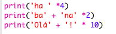
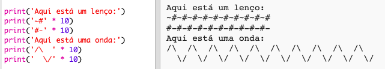

--- challenge ---

## Desafio: calcular o texto

Sabias que também podes calcular texto?!

O que irá o programa a seguir imprimir no ecrã? Vê consegues adivinhar corretamente antes de executar o programa.

Consegues inventar as tuas próprias palavras? Podes até criar os teus próprios padrões!

--- /challenge ---

**Tradução Contribuída pela Comunidade**

Este projeto foi traduzido por **Paulo Ribeiro dos Santos** e revisto por **Homero Cardoso**.

Nossos incríveis voluntários de tradução nos ajudam a dar às crianças em todo o mundo a oportunidade de aprender a programar. Pode nos ajudar a chegar a mais crianças traduzindo nossos projetos - leia mais em [rpf.io/translate](https://rpf.io/translate).