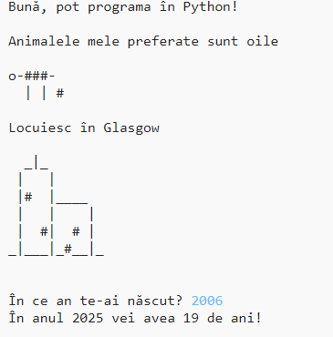

## Introducere

In this project you will learn how to write a Python program telling people all about you.

### Ce veți face

  <iframe src="https://trinket.io/embed/python/a1f663ae0d?outputOnly=true&start=result" width="600" height="500" frameborder="0" marginwidth="0" marginheight="0" allowfullscreen>
  </iframe>
  

### Ce veți învăța

This project covers elements from the following strands of the [Raspberry Pi Digital Making Curriculum](http://rpf.io/curriculum){:target="_blank"}:

+ [Folosiți elemente de bază ale programării pentru a creea programe simple](https://www.raspberrypi.org/curriculum/programming/creator){:target="_blank"}

### Informații suplimentare pentru educatori

If you need to print this project, please use the [printer-friendly version](https://projects.raspberrypi.org/en/projects/about-me/print){:target="_blank"}.

Utilizați link-ul din subsolul paginii pentru a accesa referința GitHub pentru acest proiect, care conține toate resursele (inclusiv un exemplu de proiect finalizat) în directorul ‘en / resources’.