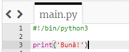
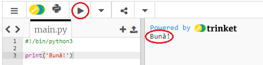
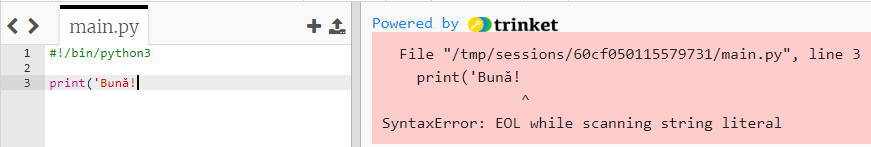
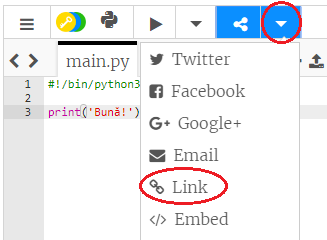

## Cum să spui salut

Să începem prin scrierea unui text.

+ Deschideți un șablon nou Python: <a href="http://jumpto.cc/python-new" target="_blank">jumpto.cc/python-new</a>.

+ Introduceți următoarele în fereastra care apare:
    
    
    
    Linia `#!/bin/python3` doar îi spune lui Trinket că folosim limbajul Python 3 (ultima versiune).

+ Apăsați pe **Run**, și ar trebui să vedeți cum comanda `print()` tipărește tot ceea ce este între apostrofuri`''`.
    
    

Dacă ați făcut o greșeală, veți primi un mesaj de eroare care vă spune unde s-a greșit!

+ Încercați! Ștergeți apostroful de la sfârșit `'` sau paranteza de închidere `)` (ori ambele) și vedeți ce se întâmplă.
    
    

+ Adaugați apostroful sau paranteza înapoi și apăsați **Run** pentru a fi siguri ca proiectul vostru funcționează din nou.

**Nu aveți nevoie de un cont Trinket pentru a vă salva proiectele!**

Dacă nu aveți un cont Trinket, dați click pe săgeată-jos și, mai apoi, pe **Link**. This will give you a link that you can save and come back to later. Va trebui să faceți acest lucru de fiecare dată când faceți modificări, deoarece link-ul se va schimba!

Dacă aveți un cont Trinket, puteți da click pe **Remix** pentru a vă salva propria copie a trinket-ului.

