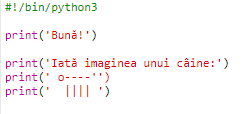
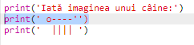
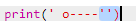
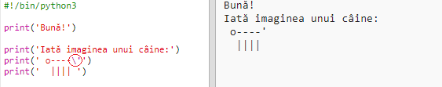
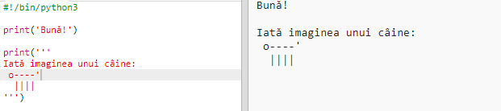

## Artă ASCII

Haideți să tipărim ceva mai distractiv decât text: artă ASCII! ASCII art (pronounced '*ask-e*') is creating **pictures out of text**.

+ Să adăugăm elemente artistice la programul tău - o imagine a unui câine!
    
    

Picioarele câinelui sunt realizate folosind caracterul bară verticală `|` pe care îl puteți tasta apăsând <kbd>Shift + \ </kbd> de pe majoritatea tastaturilor.

+ Dacă dați click pe **Run**, veți vedea că există o eroare în codul vostru.
    
    
    
    That's because your text contains an apostrophe `'`, which Python thinks is the end of the text!
    
    

+ To fix this, just put a backslash `` before the apostrophe in the word `here's`. This tells Python that the apostrophe is part of the text.
    
    

+ Dacă vreți, puteți folosi trei apostrofuri `‘’’` în loc de unul, ceea ce vă permite să tipăriți mai multe linii de text cu o singură comandă `print`:
    
    