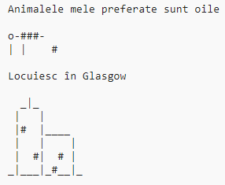

\--- challenge \---

## Provocare: despre tine

Scrieți un program Python pentru a le spune celorlalți despre voi, folosind text și artă ASCII. Puteți crea imagini cu hobby-urile, prietenii sau orice doriți!

**Nu uitați, codul pe care îl scrieți în Trinket este public. Nu distribuiți informații personale cum ar fi numele vostru complet sau adresa!**

Iată un exemplu:

\--- /challenge \---