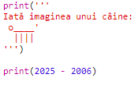
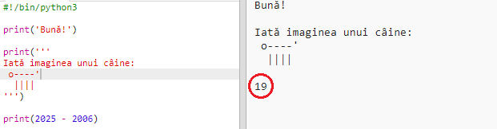
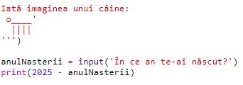
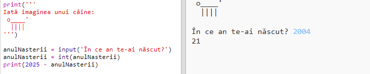
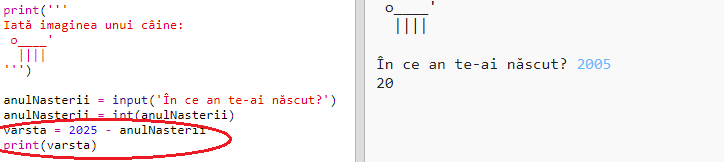
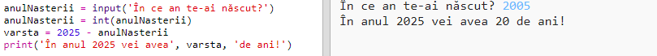

## Anul 2025

De asemenea, puteți face anumite calcule și afișa numere pe ecran. Haideți sa aflăm câți ani veți avea în anul 2025!

+ To calculate how old you'll be in the year 2025, you need to subtract the year you were born from 2025.
    
    Adăugați acest cod la program:
    
    
    
    Notice that you don't need to put quotes around numbers. (Va trebui să schimbați numărul `2006` dacă v-ați născut în alt an.)

+ Click **Run**, and your program should print your age in the year 2025.
    
    

+ You could improve your program by using `input()` to ask the user their age and store it in a **variable** called `born`.
    
    

+ Rulați programul și apoi introduceți anul în care v-ați născut. Ați primit alt mesaj de eroare?
    
    That's because anything typed into your program is **text**, and it needs to be converted to a **number**.
    
    You can use `int()` to convert the text to an **integer**. An integer is a whole number.
    
    

+ You can also create another variable to store your calculation, and print that instead.
    
    

+ Finally, you can make your program easier to understand by adding a helpful message.
    
    