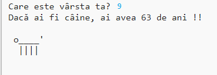

\--- challenge \---

## Provocare: vârsta ta relativ la vârsta câinelui

Scrieți un program pentru a întreba vârsta utilizatorului și apoi afișați vârsta lui convertită în anii câinilor! Puteți calcula vârsta unei persoane în anii câinilor prin înmulțirea vârstei cu 7 ani.

În programare, simbolul pentru **multiplication** este caracterul `*` pe care-l tastați folosind combinația de taste <kbd>Shift + 8</kbd> de pe tastatura.

\--- /challenge \---