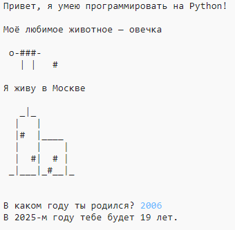

## Введение

В этом проекте вы научитесь писать программу на Python, которая рассказывает людям о вас.

### Что вам нужно сделать

  <iframe src="https://trinket.io/embed/python/a1f663ae0d?outputOnly=true&start=result" width="600" height="500" frameborder="0" marginwidth="0" marginheight="0" allowfullscreen>
  </iframe>
  

### Чему вы научитесь

Этот проект включает в себя элементы из следующих строк [Curriculum](http://rpf.io/curriculum)(: target = "_ blank"}:

+ [Используйте базовые конструкции программирования для создания простых программ](https://www.raspberrypi.org/curriculum/programming/creator){: target = "_ blank"}

### Дополнительная информация для преподавателей

Если вам нужно распечатать этот проект, пожалуйста , используйте [Версия для печати](https://projects.raspberrypi.org/en/projects/about-me/print){: TARGET = «_blank»}.

Используйте ссылку в нижнем колонтитуле для доступа к репозиторию GitHub для этого проекта, который содержит все ресурсы (включая пример завершенного проекта) в папке «en / resources».