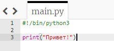
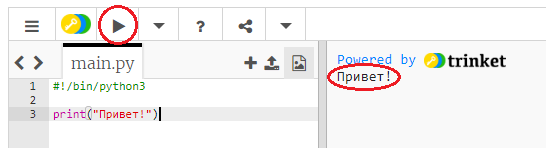
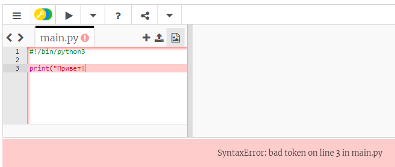
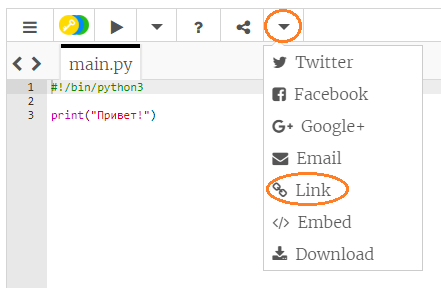

## Сказать привет

Начнем с написания текста.

+ Откройте пустой trinket (файл) c шаблоном Python: <a href="http://jumpto.cc/python-new" target="_blank">jumpto.cc/python-new</a>.

+ В появившемся окне введите следующее:
    
    
    
    Строка `#! / Bin / python3` просто сообщает Trinket, что мы используем Python 3 (последняя версия).

+ Нажмите **Выполнить**, и вы увидите, что команда `print ()` печатает все между кавычками `''`.
    
    

Если вы допустили ошибку, вы получите сообщение об ошибке, сообщающее вам, что пошло не так!

+ Попробуй! Удалите конечную цитату `'` или закрывающую скобку `)` (или оба) и посмотрите, что произойдет.
    
    

+ Добавьте цитату или скобку и нажмите **Запустить** чтобы убедиться, что ваш проект работает снова.

**Вам не нужна учетная запись Trinket для сохранения ваших проектов!**

Если у вас нет учетной записи Trinket, нажмите стрелку вниз, а затем нажмите **Ссылка**. Это даст вам ссылку, которую вы можете сохранить и вернуться к ней позже. Вам нужно будет делать это каждый раз, когда вы вносите изменения, поскольку ссылка изменится!

Если у вас есть учетная запись Trinket, вы можете нажать **Remix** чтобы сохранить свою собственную копию безделушки.

