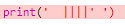

## Искусство ASCII

Давайте напечатаем что-то гораздо интереснее текста: ASCII art! Искусство ASCII (произносится «*ask-e*») создает **изображения из текста**.

+ Давайте добавим немного искусства в вашу программу - изображение собаки!
    
    

Ножки собаки сделаны с использованием символа трубы `|` которую вы можете ввести, нажав <kbd>Shift + \ </kbd> на большинстве клавиатур Великобритании / США.

+ Если вы нажмете **Run**, вы увидите, что в вашем новом коде есть ошибка.
    
    
    
    Это потому, что ваш текст содержит апостроф `'`, который, по мнению Python, является концом текста!
    
    

+ Чтобы исправить это, просто поставьте обратную косую черту `3_1_321 перед апострофом в слове <code>здесь`. Это говорит Python, что апостроф является частью текста.
    
    

+ Если вы предпочитаете, вы можете использовать три апострофа `'' '` вместо одного, что позволяет печатать несколько строк текста с одним заявлением `печати`:
    
    