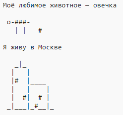

\--- вызов \---

## Задача: о себе

Напишите программу Python, чтобы рассказать другим о себе, используя текст и искусство ASCII. Вы можете создавать изображения своих хобби, друзей или всего, что вам нравится!

**Помните, что код, который вы пишете в Trinket, является общедоступным. Не сообщайте личную информацию, как ваше полное имя или адрес!**

Вот пример:

\--- /вызов \---