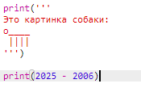
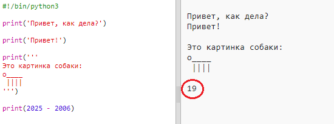
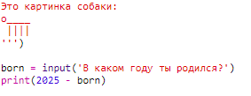
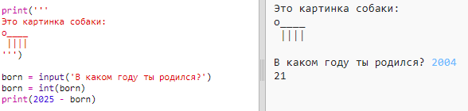
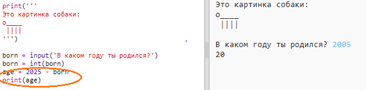
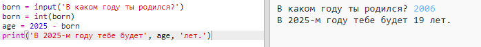

## 2025 год

Вы также можете выполнять вычисления и печатать цифры. Давайте узнаем, сколько вам лет в 2025 году!

+ Чтобы рассчитать, сколько лет вы будете в 2025 году, вам нужно вычесть год, который вы родили с 2025 года.
    
    Добавьте этот код в свою программу:
    
    
    
    Обратите внимание, что вам не нужно ставить кавычки вокруг чисел. (Вам нужно будет изменить номер `2006` если вы родились в другом году.)

+ Нажмите **Запустить**, и ваша программа должна напечатать ваш возраст в 2025 году.
    
    

+ Вы можете улучшить свою программу, используя `input ()` чтобы задать пользователю возраст и сохранить его в **переменных** получивших `родившихся`.
    
    

+ Запустите свою программу, а затем введите год, в который вы родились. Вы получили еще одну ошибку messgae?
    
    Это потому, что все, что вводится в вашу программу, равно **текста**, и его нужно преобразовать в **номер**.
    
    Вы можете использовать `int ()` для преобразования текста в **целое число**. Целое число - целое число.
    
    

+ Вы также можете создать другую переменную для хранения ваших вычислений и напечатать это вместо этого.
    
    

+ Наконец, вы можете сделать вашу программу более понятной, добавив полезное сообщение.
    
    