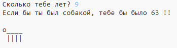

\--- вызов \---

## Задача: ваш возраст в собачьих годах

Напишите программу, чтобы спросить у пользователя их возраст, а затем расскажите им о возрасте в собачьих годах! Вы можете рассчитать возраст человека в возрасте собаки, умножив свой возраст на 7.

В программировании, символ **умножения** является `*` символов, которые обычно можно ввести, нажав <kbd>Shift + 8</kbd> на клавиатуре.

\--- /вызов \---