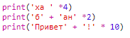
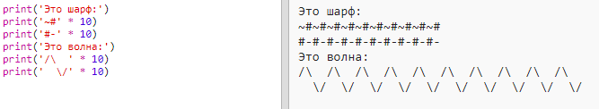

\--- вызов \---

## Задача: расчет текста

Знаете ли вы, что вы также можете рассчитать текст ?!

Что будет выводить следующая программа на экран? Посмотрите, можете ли вы правильно догадаться об этом, прежде чем запускать программу.

Можете ли вы составить какие-либо слова? Вы даже можете создавать свои собственные шаблоны!

\--- /вызов \---