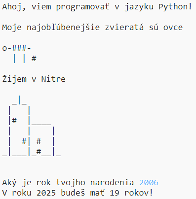

## Úvod

V tomto projekte sa naučíš, ako napísať v Pythone program, ktorý ostatným povie všetko o tebe.

### Čo budeš robiť

  <iframe src="https://trinket.io/embed/python/a1f663ae0d?outputOnly=true&start=result" width="600" height="500" frameborder="0" marginwidth="0" marginheight="0" allowfullscreen>
  </iframe>
  

### Čo sa naučíš

Tento materiál pokrýva časti z nasledujúceho výukového zdroja [Raspberry Pi Digital Making Curriculum](http://rpf.io/curriculum){:target="_blank"}:

+ [Použi základné programovacie konštrukty na vytvorenie jednoduchých programov](https://www.raspberrypi.org/curriculum/programming/creator) {:target="_blank"}

### Doplňujúce informácie pre učiteľov

Ak potrebuješ tento projekt vytlačiť, použi [verziu určenú pre tlač](https://projects.raspberrypi.org/en/projects/about-me/print){: target = "_ blank"}.

Pomocou odkazu na konci strany sa dostaneš do repozitára GitHub tohto projektu v priečinku ‘en/resources’, ktorý obsahuje všetky zdroje (vrátane príkladu hotového projektu).