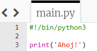
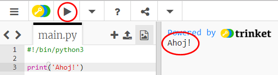
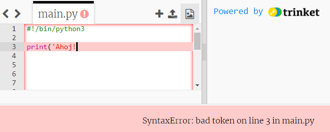
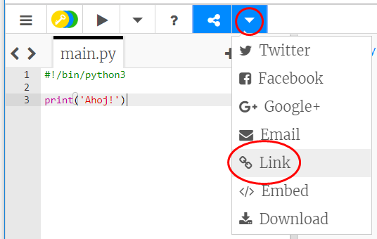
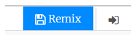

## Pozdrav

Začnime napísaním nejakého textu.

+ Otvor prázdnu šablónu Python: <a href="http://jumpto.cc/python-new" target="_blank">jumpto.cc/python-new</a>.

+ Do okna, ktoré sa zobrazí, napíš nasledujúci text:
    
    
    
    Riadok `#!/bin/python3` len povie nástroju Trinket, že používame Python 3 (najnovšiu verziu).

+ Klikni na **Run** a mal by si vidieť, že príkaz `print()` zobrazí všetko medzi znakmi `''`.
    
    

Ak si urobil/urobila chybu, zobrazí sa chybové hlásenie, ktorý ti povie, čo sa stalo!

+ Vyskúšaj to! Vymaž koncovú úvodzovku `'` alebo ukončujúcu zátvorku `)` (alebo obe) a pozri sa, čo sa stane.
    
    

+ Pridaj naspäť úvodzovku alebo zátvorku a klikni na **Run**, aby si sa uistil/uistila, že tvoj projekt opäť funguje.

**Na ukladanie svojich projektov nemusíš mať účet na Trinket-e!**

Ak na Trinket-e nemáš vytvorený účet, klikni na šípku nadol a potom na **Link**. Dostaneš odkaz, ktorý si budeš môcť uložiť a neskôr sa k nemu vrátiť. Tento postup budeš musieť zopakovať vždy po vykonaní zmien, pretože aj odkaz sa zmení!

Ak máš účet na Trinket-e, môžeš kliknúť na **Remix** a uložiť si vlastnú kópiu.

