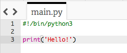

## Pozdrav

Začnime napísaním nejakého textu.

+ Otvor prázdnu šablónu Python: <a href="http://jumpto.cc/python-new" target="_blank">jumpto.cc/python-new</a>.

+ Do okna, ktoré sa zobrazí, napíš nasledujúci text:
    
    
    
    Riadok `#!/bin/python3` len povie nástroju Trinket, že používame Python 3 (najnovšiu verziu).

+ Klikni na **Run** a mal by si vidieť, že príkaz `print()` zobrazí všetko medzi znakmi `''`.
    
    

Ak si urobil/urobila chybu, zobrazí sa chybové hlásenie, ktorý ti povie, čo sa stalo!

+ Vyskúšaj to! Delete the end quote `'` or the closing bracket `)` (or both) and see what happens.
    
    

+ Add the quote or bracket back in, and click **Run** to make sure your project works again.

**You don't need a Trinket account to save your projects!**

If you don't have a Trinket account, click the down arrow and then click **Link**. This will give you a link that you can save and come back to later. You'll need to do this every time you make changes, as the link will change!

If you have a Trinket account, you can click **Remix** to save your own copy of the trinket.

