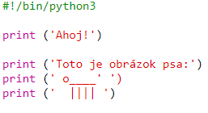
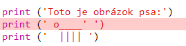
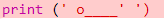
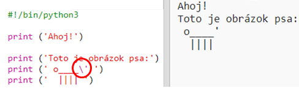
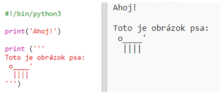

## ASCII art

Poďme vypísať niečo oveľa zábavnejšie ako text: ASCII art! ASCII art (vyslovované '*ask-e*') vytvára **obrázky z textu**.

+ Pridajme k tvojmu programu nejaké umenie - obrázok psa!
    
    

Psie nohy sú vytvorené zo znaku zvislej čiary `|`, ktorý môžeš napísať pomocou <kbd>Shift + \ </kbd> na väčšine UK/US English klávesníc, na slovenskej klávesnici ho môžeš zadať s využitím numerickej klávesnice pomocou ľavého Alt + 124.

+ Ak klikneš na tlačidlo **Run**, uvidíš, že v tvojom novom kóde je chyba.
    
    
    
    Je to preto, že tvoj text obsahuje apostrof `'`, o ktorom si Python myslí, že je koniec textu! Apostrof na väčšine UK/US English klávesníc zadáš pomocou Shift + ', na slovenskej klávesnici ho môžeš zadať s využitím numerickej klávesnice pomocou ľavého Alt + 39.
    
    

+ To fix this, just put a backslash `` before the apostrophe in the word `here's`. This tells Python that the apostrophe is part of the text.
    
    

+ If you prefer, you can use three apostrophes `'''` instead of one, which allows you to print multiple lines of text with one `print` statement:
    
    