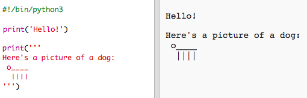

## ASCII art

Poďme vypísať niečo oveľa zábavnejšie ako text: ASCII art! ASCII art (vyslovované '*ask-e*') vytvára **obrázky z textu**.

+ Pridajme k tvojmu programu nejaké umenie - obrázok psa!
    
    

Psia hlava je vytvorená z písmena malé o.

Psie telo je vytvorená zo štyroch po sebe idúcich znakov _ .

Psie nohy sú vytvorené zo znaku zvislej čiary `|`, ktorý môžeš napísať pomocou Shift + \ na väčšine UK/US English klávesníc, na slovenskej klávesnici ho môžeš zadať s využitím numerickej klávesnice pomocou ľavého Alt + 124.

Psí chvost je vytvorený zo znaku apostrof ' , ktorý môžeš napísať pomocou Shift + ' na väčšine UK/US English klávesníc, na slovenskej klávesnici ho môžeš zadať s využitím numerickej klávesnice pomocou ľavého Alt + 39.

+ Ak klikneš na tlačidlo **Run**, uvidíš, že v tvojom novom kóde je chyba.
    
    
    
    Je to preto, že v tvojom obrázku z textu je nakreslený psí chvost pomocou znaku ' - apostrofu `'`, o ktorom si Python myslí, že je koniec textu!
    
    

+ Túto chybu opravíš jednoducho, stačí pridať znak opačného lomítka `` pred znak apostrofu v obrázku psa `o____'`. Takto povieš Pythonu, že apostrof je súčasť textu.
    
    

+ Ak chceš, namiesto jedného apostrofu môžeš použiť tri apostrofy `'''` na začiatku a konci výrazu , čím vypíšeš viaceré riadky jediným výrazom `print`:
    
    