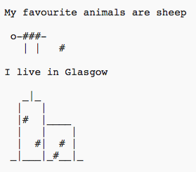

\--- výzva \---

## Výzva: o tebe

Napíš Python program, ktorým ostatným povieš niečo o sebe pomocou ASCII art. Môžeš vytvoriť obrázky tvojich koníčkov, kamarátov alebo hocičoho, čo sa ti páči!

**Nezabudni však, že kód, ktorý napíšeš v Trinkete, je verejný. Preto nezdieľaj žiadne osobné informácie, ako napríklad celé tvoje meno a priezvisko, či tvoja adresa!**

Tu je príklad:

\--- /výzva \---