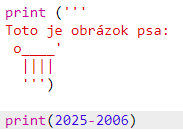
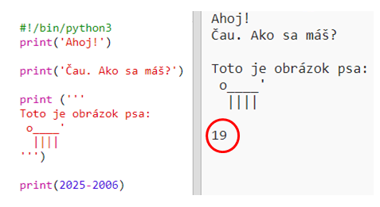
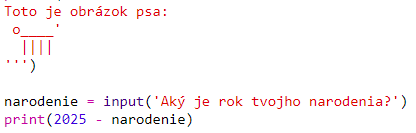
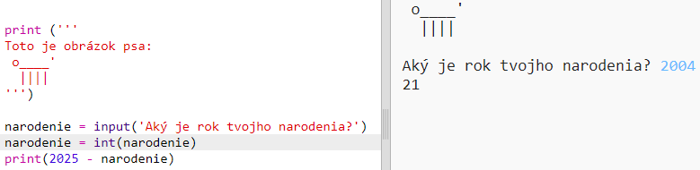
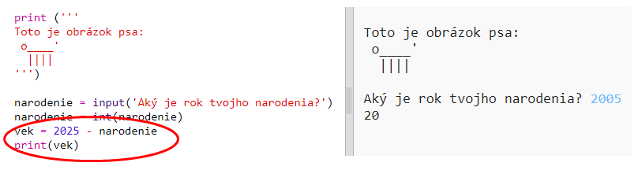
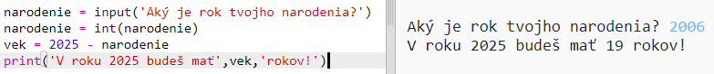

## Rok 2025

Taktiež môžeš robiť výpočty a zobrazovať čísla. Poďme zistiť, koľko rokov budeš mať v roku 2025!

+ Pre vypočítanie tvojho veku v roku 2025 musíš odčítať rok tvojho narodenia od čísla 2025.
    
    A toto je kód tvojho programu:
    
    
    
    Všimni si, že apostrofy nemusíš dávať pred a za čísla. (Budeš musieť zmeniť číslo `2006`, ak tvoj rok narodenia je iný ako rok 2006.)

+ Klikni na **Run** a tvoj program by mal vypísať tvoj vek v roku 2025.
    
    

+ You could improve your program by using `input()` to ask the user their age and store it in a **variable** called `born`.
    
    

+ Run your program and then enter the year you were born. Did you get another error message?
    
    That's because anything typed into your program is **text**, and it needs to be converted to a **number**.
    
    You can use `int()` to convert the text to an **integer**. An integer is a whole number.
    
    

+ You can also create another variable to store your calculation, and print that instead.
    
    

+ Finally, you can make your program easier to understand by adding a helpful message.
    
    