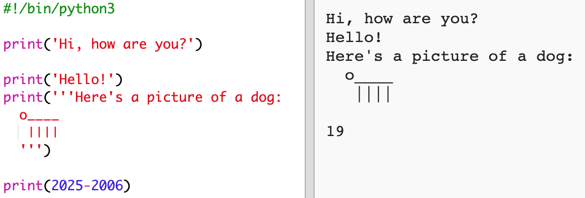
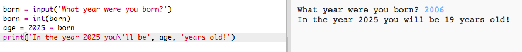

## Rok 2025

Taktiež môžeš robiť výpočty a zobrazovať čísla. Poďme zistiť, koľko rokov budeš mať v roku 2025!

+ Pre vypočítanie tvojho veku v roku 2025 musíš odčítať rok tvojho narodenia od čísla 2025.
    
    A toto je kód tvojho programu:
    
    
    
    Všimni si, že apostrofy nemusíš dávať pred a za čísla. (Budeš musieť zmeniť číslo `2006`, ak tvoj rok narodenia je iný ako rok 2006.)

+ Klikni na **Run** a tvoj program by mal vypísať tvoj vek v roku 2025.
    
    

+ Môžeš vylepšiť svoj program použitím príkazu `input()`, ktorým sa opýtaš užívateľa na rok jeho narodenia a uložiť ho do **premennej** nazvanej `narodenie`.
    
    

+ Spusť program a zadaj rok tvojho narodenia. Zobrazila sa ti chybová hláška?
    
    Je to preto, lebo čokoľvek zadané do tvojho programu cez príkaz input() je **text** a ten musí byť prevedený (konvertovaný) na **číslo**.
    
    Môžeš použiť príkaz `int()`, ktorý konvertuje text na **integer**. Integer je typ údaju celé číslo.
    
    

+ Môžeš tiež vytvoriť ďalšiu premennú na uloženie výpočtu a namiesto toho ju vypísať.
    
    

+ Nakoniec môžete program upraviť, aby bol ľahšie pochopiteľný tak, že pridáš pomocnú správu.
    
    