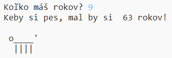

\--- výzva \---

## Výzva: tvoj vek v psích rokoch

Napíš program, ktorý se užívateľa spýta na jeho vek a prepočíta ho na vek psí! Vek užívateľa v psích rokoch môžeš vypočítať vynásobením veku užívateľa hodnotou 7.

V programovaní symbolom pre **násobenie** je znak `*`, ktorý zvyčajne zadávate stlačením <kbd>Shift + 8</kbd> na UK/US English klávesnici, na slovenskej klávesnici ho môžeš zadať s využitím numerickej klávesnice pomocou klávesy *.

\--- /výzva \---