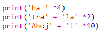
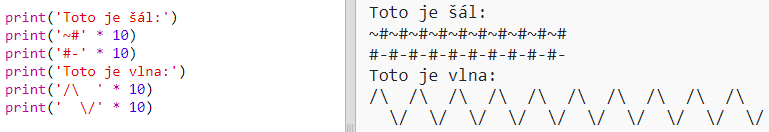

\--- výzva \---

## Výzva: počítanie s textom

Vieš, že môžeš počítať aj text?!

Čo vypíše nasledujúci program na obrazovku? Skús, či to vieš uhádnuť ešte predtým, než spustíš program.

Dokážeš takto poskladať slová podobným spôsobom? Môžeš dokonca vytvárať vlastné vzory!

\--- /výzva \---