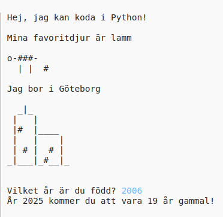

## Inledning

I det här projektet lär du dig hur man skriver ett Python-program som berättar allt om dig.

### Vad du kommer att göra

  <iframe src="https://trinket.io/embed/python/8721eff5c5?outputOnly=true&start=result" width="600" height="500" frameborder="0" marginwidth="0" marginheight="0" allowfullscreen>
  </iframe>
  

### Vad du kommer att lära dig

Detta projekt omfattar element från följande rader av [Raspberry Pi Digital Making Curriculum](http://rpf.io/curriculum){:target="_blank"}:

+ [Använd grundläggande programmeringskonstruktioner för att skapa enkla program](https://www.raspberrypi.org/curriculum/programming/creator){:target="_blank"}

### Ytterligare information för lärare

Om du behöver skriva ut det här projektet, använd den [utskriftsvänliga versionen](https://projects.raspberrypi.org/sv-SE/projects/about-me/print){:target="_blank"}.

Använd länken i sidfoten för att komma till GitHub-arkivet för det här projektet, vilket innehåller alla resurser (inklusive ett exempel på det färdiga projekt) i mappen "sv-SE/resources".