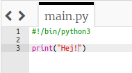
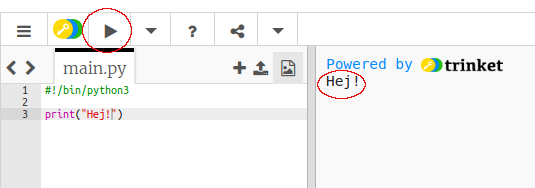
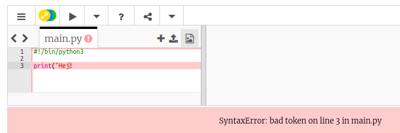
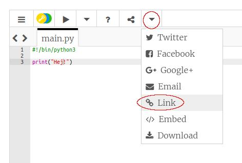

## Säga hej

Låt oss börja med att skriva lite text.

+ Öppna den tomma Python-mallen trinket: <a href="http://jumpto.cc/python-new" target="_blank">jumpto.cc/python-new</a>.

+ Skriv följande i fönstret som visas:
    
    
    
    Raden `#!/bin/python3` berättar bara för Trinket att vi använder Python 3 (den senaste versionen).

+ Klicka på **Kör**, och du borde se att kommandot `print()` skriver ut allt mellan citationstecknen `''`.
    
    

Om du har gjort ett misstag får du i stället ett felmeddelande som berättar vad som gick fel!

+ Försök! Ta bort det sista citationstecknet `'` eller höger parentesen `)` (eller båda) och se vad som händer.
    
    

+ Skriv in citationstecknet eller parentesen igen och klicka på **Kör** för att se till att ditt projekt fungerar igen.

**Du behöver inte ett Trinket-konto för att spara dina projekt!**

Om du inte har ett Trinket-konto klickar du på pil nedåt och klickar sedan på **Link**. Detta ger dig en länk som du kan spara och komma tillbaka till senare. Du måste göra detta varje gång du gör ändringar, eftersom länken kommer att förändras!

Om du har ett Trinket-konto kan du klicka på **Remix** att spara din egen kopia av din trinket.

