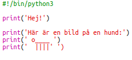
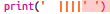
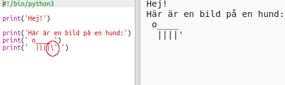
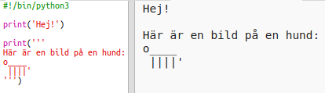

## ASCII-konst

Låt oss skriva ut något mycket roligare än text: ASCII-konst! ASCII-konst (uttalas "*ask-e*") skapar **bilder av text**.

+ Låt oss lägga till lite konst i ditt program - en bild av en hund!
    
    

Hundens ben är gjorda med streckkaraktären `|` som du kan skriva genom att trycka på <kbd>Alt Gr + <</kbd> på de flesta svenska tangentbord.

+ Om du klickar på **Kör**, ser du att det finns ett fel i din nya kod.
    
    
    
    Det beror på att texten innehåller en apostrof `'`, som Python tycker är slutet på texten!
    
    

+ To fix this, just put a backslash `` before the apostrophe in the word `here's`. Detta berättar för Python att apostrofen är en del av texten.
    
    

+ Om du föredrar kan du använda tre apostrofer ` '''` istället för en, som låter dig skriva ut flera rader med text med ett `print` uttryck:
    
    