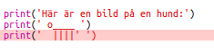

## ASCII -konst

Låt oss skriva ut något mycket roligare än text: ASCII -konst! ASCII -konst (uttalad "*ask-ii*") skapar **bilder ur text**.

+ Låt oss lägga till lite konst i ditt program - en bild av en hund!
    
    

Hundens ben är gjorda med streckkaraktären `|` som du kan skriva genom att trycka på <kbd>Shift + \ </kbd> på de flesta brittiska/amerikanska tangentbord.

+ Om du klickar på **Kör**, ser du att det finns ett fel i din nya kod.
    
    
    
    Det beror på att texten innehåller en apostrof `'`, som Python tycker är slutet på texten!
    
    

+ Lös problemet genom att bara sätta ett omvänt snedstreck `` innan apostrofen i ordet `här är`. Detta berättar Python att apostrof är en del av texten.
    
    

+ Om du föredrar kan du använda tre apostrofer ` '' '` istället för en, som låter dig skriva ut flera rader med text med ett ` utskrift ` uttryck:
    
    