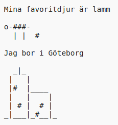

\--- utmaning \---

## Utmaning: om dig själv

Skriv ett Python-program för att berätta för andra om dig själv med hjälp av text och ASCII-konst. Du kan skapa bilder av dina hobbyer, vänner eller allt du vill!

**Kom ihåg att koden du skriver i Trinket är allmän. Dela inte personliga uppgifter som ditt fullständiga namn eller adress!**

Här är ett exempel:

\--- /utmaning \---