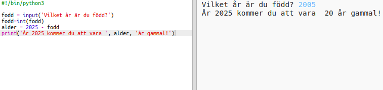

## Året 2025

Du kan också göra beräkningar och skriva ut siffror. Låt oss ta reda på hur gammal du kommer att vara år 2025!

+ För att beräkna hur gammal du ska vara år 2025 måste du subtrahera det år du föddes från 2025.
    
    Lägg till den här koden i ditt program:
    
    
    
    Observera att du inte behöver lägga citat runt nummer. (Du måste ändra nummer `2006` om du föddes i ett annat år.)

+ Klicka på **Kör**, och ditt program ska skriva ut din ålder år 2025.
    
    

+ Du kan förbättra ditt program genom att använda `input ()` att fråga användaren sin ålder och lagra den i en **variabel** kallad `född`.
    
    

+ Kör ditt program och skriv in det år du föddes. Fick du en annan fel messgae?
    
    Det beror på att allt som skrivits in i ditt program är **text**, och det måste konverteras till ett **nummer**.
    
    Du kan använda `int ()` att konvertera texten till ett **heltal**. Ett heltal är ett heltal.
    
    

+ Du kan även skapa en annan variabel för att lagra din beräkning och skriva ut den istället.
    
    

+ Slutligen kan du göra ditt program lättare att förstå genom att lägga till ett bra meddelande.
    
    