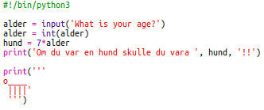

\--- utmaning \---

## Utmaning: Din ålder i hundår

Skriv ett program för att fråga användaren sin ålder och säg sedan deras ålder i hundår! Du kan beräkna en persons ålder i hundåren genom att multiplicera deras ålder med 7.

I programmering är symbolen för **multiplikation** den `*` tecken som du vanligtvis kan skriva genom att trycka på <kbd>Shift + 8</kbd> på tangentbordet.

\--- /utmaning \---