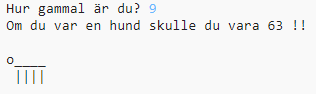

\--- challenge \---

## Utmaning: Din ålder i hundår

Skriv ett program för att fråga användarens ålder och sedan visa hens ålder i hundår! Du kan beräkna en persons ålder i hundår genom att multiplicera deras ålder med 7.

I programmering är symbolen för **multiplikation** tecknet `*` som du vanligtvis kan skriva genom att trycka på <kbd>Shift + 8</kbd> på tangentbordet.

\--- /challenge \---