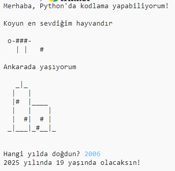

## Giriş

Bu projede, insanlara kendiniz hakkında herşeyi anlattığınız bir Python programı yazmayı öğreneceksiniz.

### Ne yapacaksınız

  <iframe src="https://trinket.io/embed/python/a63fe15c7a?outputOnly=true&start=result" width="600" height="500" frameborder="0" marginwidth="0" marginheight="0" allowfullscreen>
  </iframe>
  

### Ne öğreneceksiniz

Bu proje, [Raspberry Pi Digital Making Curriculum](http://rpf.io/curriculum){:target="_blank"} 'un aşağıdaki bölümünden bilgiler kapsamaktadır:

+ [Basit programlar oluşturmak için temel programlama yapılarını kullanın](https://www.raspberrypi.org/curriculum/programming/creator){:target="_blank"}

### Eğitimciler için ek bilgiler

Bu projeyi yazdırmanız gerekiyorsa lütfen [yazıcı-dostu sürümü](https://projects.raspberrypi.org/tr-TR/projects/about-me/print){:target="_blank"} kullanın.

Bu projeye ait bütün kaynakları içeren (bitmiş örnek bir proje de dahil!) GitHub Repo'suna erişmek için, en alttaki linke tıklayabilirsiniz. Kaynaklar, 'tr-TR/resources' klasöründe bulunmakta.