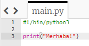

## Merhaba demek

Biraz metin yazarak başlayalım.

+ Trinket'ta boş Python şablonunu açın: <a href="http://jumpto.cc/python-new" target="_blank">jumpto.cc/python-new</a>.

+ Aşağıdakileri açılan pencereye yazın:
    
    
    
    `#!/bin/python3` satırı, Trinket'a Python 3 (son sürümü) kullandığımızı bildiriyor.

+ **Run** (Çalıştır)'a tıklayın ve `print()` (yazdır) komutunun `''`tırnak işareti arasındaki her şeyi yazdığını göreceksiniz.
    
    

Bir hata yaptıysanız, neyin yanlış gittiğini söyleyen bir hata mesajı alırsınız!

+ Deneyin! Sondaki `'` kesme işaretini ya da `)` parantez işaretini (veya her ikisi) silin ve neler olacağını görün.
    
    

+ Projenizin tekrar çalıştığından emin olmak için kesme işaretini ve parantezi yerine ekleyin ve **Run** (Çalıştır)'a tıklayın.

**Projelerinizi kaydetmek için bir Trinket hesabına ihtiyacınız yok!**

Bir Trinket hesabınız yoksa, aşağı okuna ve ardından **Link**'e tıklayın. Bu size kaydedebileceğiniz ve daha sonra geri dönebileceğiniz bir bağlantı verecektir. Her değişiklik yaptığınızda, bağlantı değişeceğinden bunu tekrar yapmanız gerekecektir!

Trinket hesabınız varsa kendi trinket kopyanızı **Remix** tuşuna tıklayarak kaydedebilirsiniz.

