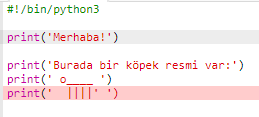
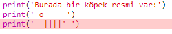
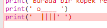
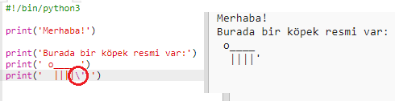
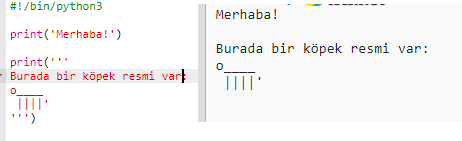

## ASCII sanatı

Düz yazıdan çok daha eğlenceli bir şey yazdıralım: ASCII sanatı! ASCII sanatı ('*aski*' diye telaffuz edilir) ** yazı karakterlerinden resim oluşturmaktadır**.

+ Hadi programınıza biraz sanat ekleyelim - bir köpeğin resmi!
    
    

Köpeğin bacakları, genellikle Türkçe klavyelerde <kbd>AltGr ve -</kbd> tuş ikilisine basılarak elde edilen düz çizgi `|` ile yapılabilir.

+ **Run** (Çalıştır)'ı tıklarsanız, yeni kodunuzda bir hata olduğunu göreceksiniz.
    
    
    
    Çünkü metninizde, Python'un yazının sonlandırılmış olduğunu düşündüren bir kesme işareti `'` bulunuyor!
    
    

+ Bunu düzeltmek için, köpeğin ASCII sanat resminde kuyruğunu gösteren `'` kesme işaretinin hemen öncesine sadece bir ters eğik çizgi `` koyun. Bu Python'a kesme işaretinin metnin bir parçası olduğunu söyler.
    
    

+ Dilerseniz her satırda bir kesme işareti yazmak yerine tek bir `print` komutuyla birçok satır yazmanıza olanak sağlayan üç tane kesme işaretini `'''` de kullanabilirsiniz:
    
    