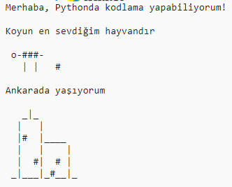

--- challenge ---

## Meydan okuma: kendin hakkında

Metin ve ASCII sanatını kullanarak başkalarına kendinizden bahsetmek için bir Python programı yazınız. Hobilerinizin, arkadaşlarınızın veya istediğiniz herhangi bir şeyin resimlerini oluşturabilirsiniz!

**Trinket’da yazdığınız kodun herkese açık olduğunu unutmayın. Adınız veya açık adresiniz gibi hiçbir kişisel bilginizi paylaşmayın!**

İşte bir örnek:

--- /challenge ---