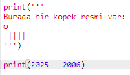
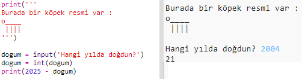

## 2025 yılı

Ayrıca hesaplamalar yapabilir ve sayıları yazdırabilirsiniz. Hadi 2025 yılında kaç yaşında olacağınızı öğrenelim!

+ 2025 yılında kaç yaşında olacağınızı hesaplamak için, 2025'ten doğduğunuz yılı çıkarmanız gerekir.
    
    Bu kodu programınıza ekleyin:
    
    
    
    Sayıların yanına tırnak işareti koymaya gerek olmadığına dikkat edin. (Eğer farklı bir yılda doğmuşsanız, `2006` yılını değiştirmeniz gerekecek.)

+ **Run** (Çalıştır)'a tıklayın ve programınız 2025 yılındaki yaşınızı yazmış olmalıdır.
    
    

+ Programınızı, kullanıcıya yaşını sorup `dogum` adı verilen bir **değişken**'de saklayan `input()` komutuyla geliştirebilirsiniz.
    
    

+ Programınızı çalıştırın ve sonra doğduğunuz yılı girin. Başka bir hata mesajı aldınız mı?
    
    Çünkü programınıza yazılan herhangi bir şey **metin**'dir ve bunun **sayı**'ya çevrilmesi gerekir.
    
    `int()` fonksiyonunu kullanarak metni **tamsayı**'ya çevirebilirsiniz. Bir tam sayı doğal sayıdır.
    
    

+ Hesaplamanızı saklamak için başka bir değişken de oluşturabilir ve bunun yerine yazdırabilirsiniz.
    
    

+ Son olarak, yararlı bir mesaj ekleyerek programınızın anlaşılmasını kolaylaştırabilirsiniz.
    
    