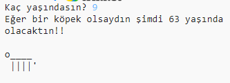

--- challenge ---

## Meydan okuma: Köpek takvimine göre yaşınız

Kullanıcıya yaşlarını sorarak köpek takvimine göre kaç yaşında olduğunu gösteren bir program yazın! Bir kişinin köpek takvimine göre yaşını 7 ile çarparak hesaplayabilirsiniz.

Programlamada, **çarpma işleminin** sembolü `*` karakteridir ve klavyede <kbd>*</kbd> tuşuna basılarak yazılır.

--- /challenge ---