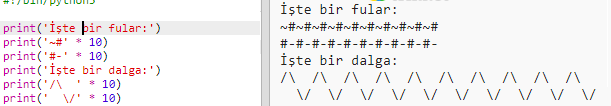

--- challenge ---

## Meydan okuma: metin hesaplama

Metin de hesaplayabileceğinizi biliyor muydunuz?!

Aşağıdaki program ekrana ne yazdıracak? Programı çalıştırmadan önce doğru tahmin edip edemediğinizi görün.

Bu şekilde kendi kelimelerinizi de yapabilir misiniz? Kendi şekillerinizi bile yapabilirsiniz!

--- /challenge ---

***
Bu proje gönüllüler tarafından tercüme edildi:

Volkan Çevik

Berkan Ali

Dünyanın dört bir yanındaki insanlara anadilinde öğrenme şansı verebildiğimiz için gönüllülere teşekkür ederiz. Daha fazla gönüllü tercümana ulaşmamızda bize yardımcı olabilirsiniz - [rpf.io/translate](https://rpf.io/translate) adresinden daha fazla bilgiye ulaşabilirsiniz.