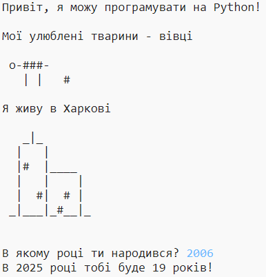

## Вступ

У цьому проекті ви дізнаєтеся, як написати програму Python, яка розповість людям про вас.

### Що ви будете робити

  <iframe src="https://trinket.io/embed/python/a1f663ae0d?outputOnly=true&start=result" width="600" height="500" frameborder="0" marginwidth="0" marginheight="0" allowfullscreen>
  </iframe>
  

### Що ви дізнаєтесь

Цей проект охоплює елементи з наступних напрямків навчальної програми [Raspberry Pi Digital Making](http://rpf.io/curriculum)(: target = "_ blank"):

+ [Використовуйте базові конструкторські програми для створення простих програм](https://www.raspberrypi.org/curriculum/programming/creator)(: target = "_ blank")

### Додаткова інформація для вихователів

Якщо вам потрібно надрукувати цей проект, скористайтеся [версія для друку](https://projects.raspberrypi.org/en/projects/about-me/print)(: target = "_ blank").

Скористайтеся посиланням у нижньому колонтитулі, щоб отримати доступ до сховища GitHub для даного проекту, який містить усі ресурси (включаючи приклад готового проекту) в папці en / resources.