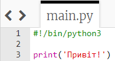
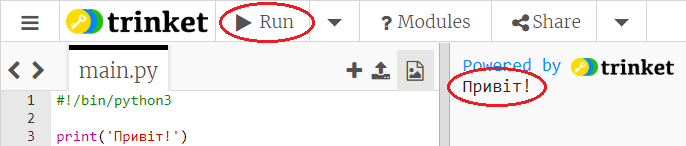
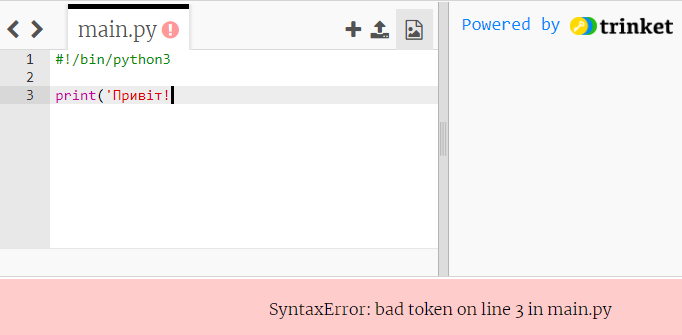
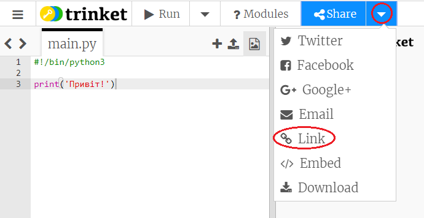
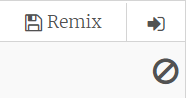

## Говорячи привіт

Почнемо з написання деякого тексту.

+ Відкрийте бланк шаблону Python: <a href="http://jumpto.cc/python-new" target="_blank">jumpto.cc/python-new</a>.

+ Введіть наступне вікно, яке з'явиться:
    
    
    
    Лінія `#! / Bin / python3` просто повідомляє Trinket, що ми використовуємо Python 3 (останню версію).

+ Натисніть **Виконати**, і ви повинні побачити, що команда `print ()` друкує все, що знаходиться між цитатками `''`.
    
    

Якщо ви зробили помилку, ви отримаєте повідомлення про помилку, в якому повідомляється, що помилився!

+ Спробуй це! Видаліть кінцеву цитату `'` або закриваючу дужку `)` (або обидва) і подивіться, що станеться.
    
    

+ Додати цитату або кронштейн знову та натисніть **Запустити** , щоб переконатися, що ваш проект знову працює.

**Вам не потрібен обліковий запис Trinket для збереження ваших проектів!**

Якщо у вас немає облікового запису Trinket, натисніть стрілку вниз та натисніть **Посилання**. Це дасть вам посилання, яке ви можете зберегти, і поверніться пізніше. Вам потрібно буде це робити щоразу, коли ви внесете зміни, оскільки посилання зміниться!

Якщо у вас є обліковий запис Trinket, ви можете натиснути **Remix** , щоб зберегти власну копію дрібнички.

