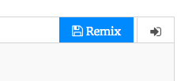

## Привітання

Давай почнемо з написання тексту.

+ Відкрий пустий шаблон для Python у Trinket: <a href="http://jumpto.cc/python-new" target="_blank">jumpto.cc/python-new</a>.

+ У вікні, що з'явилося, введи наступне:
    
    
    
    Рядок `#!/bin/python3` просто повідомляє Trinket, що ми використовуємо Python 3 (останню версію).

+ Натисни **Run**, і ти повинен побачити, що команда `print()` друкує все, що знаходиться між лапками `''`.
    
    

Якщо ти помилився, то натомість отримаєш повідомлення про помилку, в якому буде сказано, що пішло не так!

+ Спробуй! Видали закриваючу лапку `'` або закриваючу дужку `)` (або і те, і інше) та подивись, що станеться.
    
    

+ Поверни назад лапку чи дужку та натисни **Run**, щоб переконатися, що твій проект знову працює.

**Тобі не потрібен обліковий запис у Trinket, щоб збереігати свої проекти!**

Якщо у тебе немає облікового запису в Trinket, натисни стрілку вниз, а потім натисни **Link**. Ти отримаєш посилання, яке можна зберегти, і повернутись пізніше. Тобі потрібно це робити кожного разу після внесення змін, бо посилання зміниться!

Якщо у тебе є обліковий запис у Trinket, ти можеш натиснути **Remix**, щоб зберегти власну копію проекту.

