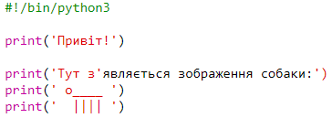
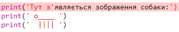
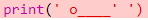
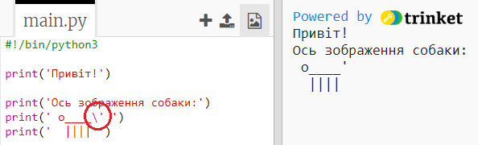
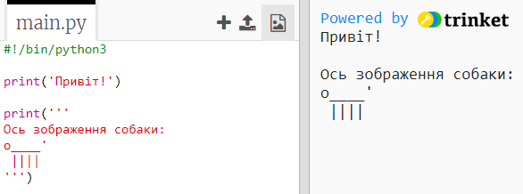

## ASCII art

Назвемо щось набагато веселіше, ніж текст: ASCII art! ASCII art (вимовляється як '*ask-e*') створює **фотографії з тексту**.

+ Давайте додамо мистецтво до вашої програми - фотографію собаки!
    
    

Лапи собак виконані за допомогою символу трубка `|`, яку ви можете ввести, натиснувши <kbd>Shift + \ </kbd> на більшості англійських клавіатур.

+ Якщо ви натиснете **Виконати**, ви побачите, що у вашому новому коді є помилка.
    
    
    
    Це тому, що ваш текст містить апостроф `'`, який, на думку Python, є кінцем тексту!
    
    

+ Щоб це виправити, просто поставте зворотну риску `` перед апострофом у слові `тут`. Це говорить Phyton, що апостроф є частиною тексту.
    
    

+ Якщо ви віддаєте перевагу, ви можете використовувати три апострофа `'' '` замість одного, що дозволяє друкувати кілька рядків тексту за допомогою одного `друку` оператора:
    
    