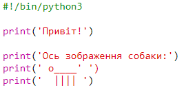

## ASCII-мистецтво

Давайте надрукуємо щось набагато цікавіше, ніж текст: ASCII-графіку! ASCII-графіка (вимовляється *аскі* ') створює **зображення з тексту**.

+ Давайте додамо графіку до вашої програми - зображення собаки!
    
    

Лапи собаки виконані за допомогою вертикальної риски `|`, яку ви можете ввести, натиснувши <kbd>Shift + \ </kbd> на більшості англійських клавіатур.

+ Якщо ви натиснете **Run**, ви побачите, що у вашому новому коді є помилка.
    
    
    
    Це тому, що ваш текст містить апостроф `'`, який Python вважає кінцем тексту!
    
    

+ Щоб це виправити, просто введіть зворотну косу риску `` перед апострофом у слові `з'являється`. Це говорить Python, що апостроф є частиною тексту.
    
    

+ За бажанням можна використовувати потрійні лапки `'''` замість одних, що дозволяє друкувати декілька рядків тексту за допомогою однієї команди `print`:
    
    