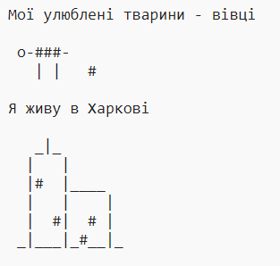

\--- завдання \---

## Виклик: про себе

Напишіть програму Python, щоб розповісти іншим про себе, використовуючи текстові та ASCII арт. Ви можете створювати зображення ваших хобі, друзів або що завгодно!

**Пам'ятайте, що код, який ви пишете в брелок, є загальнодоступним. Не повідомляйте особисту інформацію, таку як ваше повне ім'я або адресу!**

Ось приклад:

\--- / виклик \---