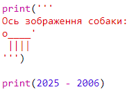
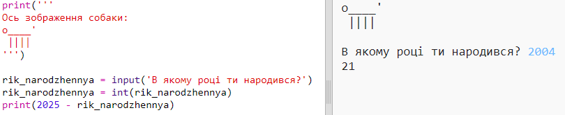

## 2025 рік

Ви також можете робити розрахунки та роздруковувати номери. Давайте дізнаємося, скільки років вам буде в 2025 році!

+ Щоб підрахувати, скільки років ви будете в 2025 році, вам потрібно відняти рік, коли ви народилися з 2025 року.
    
    Додайте цей код до своєї програми:
    
    
    
    Зверніть увагу, що вам не потрібно вводити лапки навколо цифр. (Вам потрібно буде змінити номер `2006` , якщо ви народилися в інший рік.)

+ Натисніть **Запустити**, і ваша програма має опублікувати свій вік у 2025 році.
    
    

+ Ви можете покращити свою програму, використовуючи `input ()` , щоб запитати користувача свого віку та зберегти його в **змінній** називається `born`.
    
    

+ Запустіть свою програму, а потім введіть рік народження. Ви отримали ще одну помилку messgae?
    
    Це тому, що щось набране вашою програмою, є **текст**, і його потрібно перетворити на **число**.
    
    Ви можете використовувати `int ()` , щоб перетворити текст у **ціле число**. Ціле число - це ціле число.
    
    

+ Ви також можете створити ще одну змінну, щоб зберегти свій розрахунок, а потім надрукувати його.
    
    

+ Нарешті, ви можете зробити свою програму легше зрозумілою, додавши корисне повідомлення.
    
    