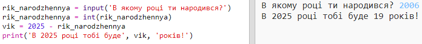

## 2025 рік

Ви також можете робити розрахунки та друкувати числа. Давайте дізнаємося, скільки років вам буде в 2025 році!

+ Щоб підрахувати, скільки років вам буде в 2025 році, вам потрібно відняти від 2025 рік, у якому ви народилися.
    
    Додайте цей код до своєї програми:
    
    
    
    Зверніть увагу, що вам не потрібно ставити лапки для чисел. (Вам необхідно змінити номер `2006`, якщо ви народилися в іншому році.)

+ Натисніть **Run**, і ваша програма має показати ваш вік у 2025 році.
    
    

+ Ви можете вдосконалити вашу програму, використовуючи `input()`, щоб дізнатися рік народження користувача та зберегти його в **змінній**, яка називається `rik_narodzhennya`.
    
    

+ Запустіть свою програму, а потім введіть рік народження. Did you get another error message?
    
    Це тому, що щось набране вашою програмою, є **текст**, і його потрібно перетворити на **число**.
    
    Ви можете використовувати `int ()` , щоб перетворити текст у **ціле число**. Ціле число.
    
    

+ Ви також можете створити ще одну змінну, щоб зберегти свій розрахунок, а потім надрукувати його.
    
    

+ Нарешті, ви можете зробити свою програму більш зрозумілою, додавши корисне повідомлення.
    
    