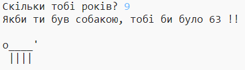

\--- завдання \---

## Виклик: ваш вік у собачих літах

Напишіть програму, щоб поставити користувачеві свій вік, а потім сказати їм свій вік у роки собак! Ви можете розрахувати вік людини в роки собак, помноживши їх вік на 7.

У програмуванні символ **множення** є символом `*` , який зазвичай можна ввести, натиснувши <kbd>Shift + 8</kbd> на клавіатурі.

\--- / виклик \---