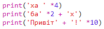

\--- challenge \---

## Завдання: обчислення тексту

Ви знали, що ви також можете розрахувати текст ?!

Що наступна програма буде друкувати на екрані? Подивіться, чи правильно ви це вгадаєте перед запуском програми.

Ви можете скласти будь-які ваші слова? Ви навіть можете створити свої власні моделі!

\--- /challenge \---