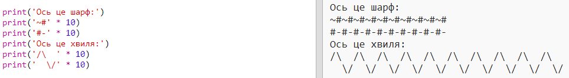

--- challenge ---

## Завдання: рахування тексту

Ти знав/ла, що можеш рахувати текст?!

Що надрукує на екрані наступна програма? Спробуй вгадати перед тим, як запустити програму.

Чи можеш ти вигадати якісь свої слова? Ти навіть можеш створити свої власні шаблони!

--- /challenge ---

***
Переклад спільноти волонтерів

Цей проект переклали: Павло Фесенко і перевірили: Mykhailo Tymchyshyn.

Наші чудові добровольці з питань перекладу допомагають нам надати дітям у всьому світі можливість навчитися програмувати. Ви можете допомогти нам охопити більше дітей, перекладаючи наші проекти - подробиці на [rpf.io/translate](https://rpf.io/translate).